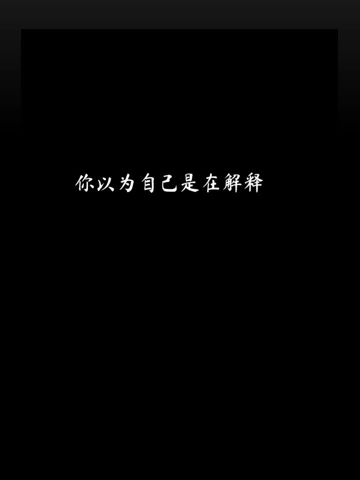
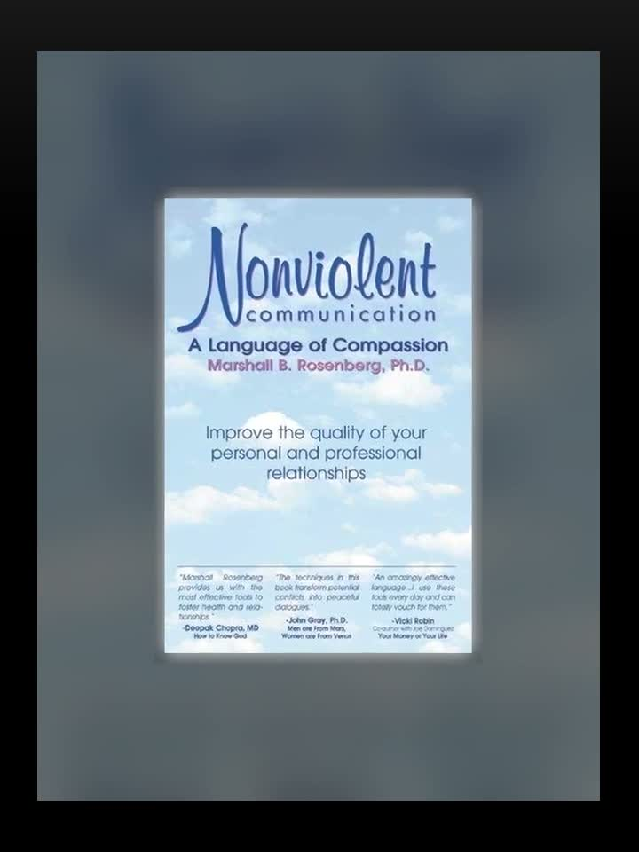
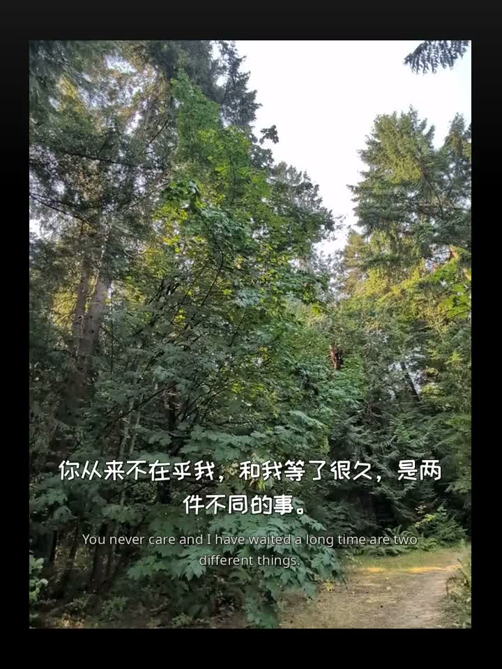
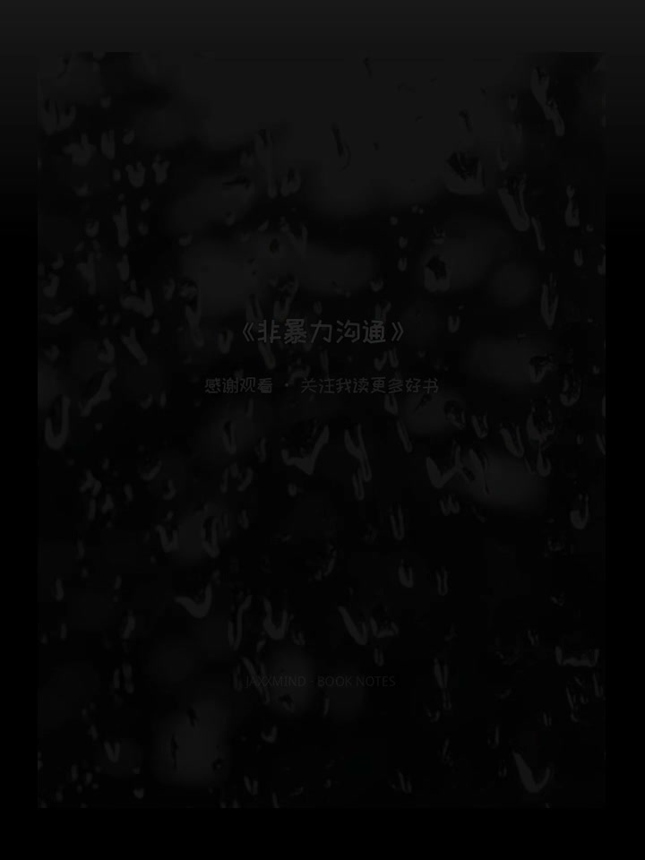

最近给工厂加了一条本地 B-roll 渲染管线（`render_broll_video.py`），用《非暴力沟通》实跑了一版 63 秒的 3:4 成片。整条链路长这样：

**1. 开场：逐字浮现的文字动画**

黑底书法体（马善政体），hook 句逐字「模糊 → 清晰」浮现，每字带 10px 上浮和三次方缓动，时长与 hook 配音严格对齐。

**2. 书封快切轮播**

封面以 0.45s 节奏快切，配渐强鼓点；书名语音的落点被精确安排在封面驻留段内，渲染前用 `timeline_map.py` 干跑一遍对轨校验。

**3. 正文：B-roll + 双语字幕**

正版商用许可的短视频素材（Coverr / Pexels / Pixabay，带 sha256 来源记录）统一归一化到 720×960@30fps，按旁白段落切分。字幕时间戳来自 Whisper 词级 ASR 对齐——繁转简后精确匹配、模糊匹配、比例摊铺三级回退，绝不凭空发明时间点。

**4. 混音与片尾**

BGM 全程 loudnorm 响度归一，人声进入时 sidechain 闪避；每路音频先统一重采样到 48kHz 立体声再混（否则 ffmpeg 的 amix 会随机静默某一路），混完逐条测 RMS 确认没丢声。片尾画面缩成卡片叠在渐变垫上。

**5. 渲染后验证**

`verify_render.py` 做三级审计：WAV 头时长一致性 → 开场混音逐条 RMS 探针 → 用 Whisper 转写整个成片，逐句核对文稿 15 句是否齐全、顺序是否正确。

配音用 CosyVoice 生成，渲染器本身不生成语音、只做编排——生成和渲染是分离的，任何一环都能单独替换和重跑。
