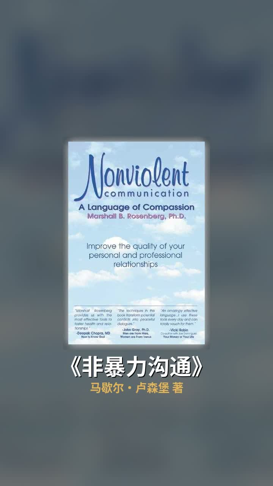
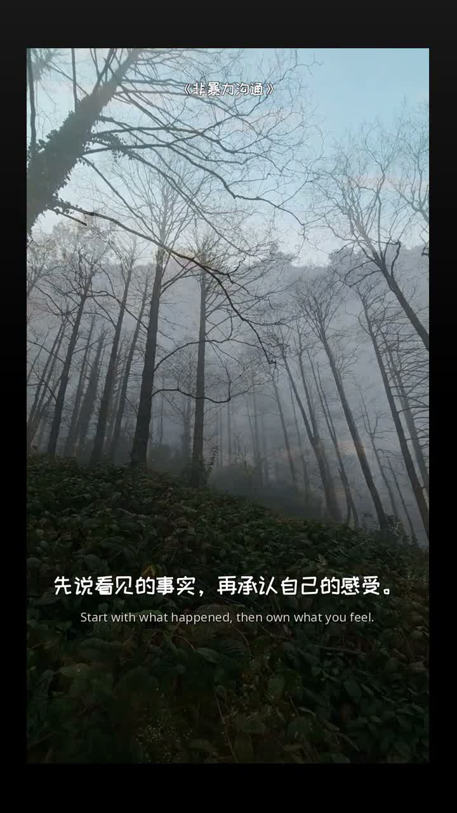

看完上一版 3:4 成片后，这轮把管线上了 9:16 竖屏（720×1280），顺手重做开头并收紧节奏，用《非暴力沟通》出了一版 61.7 秒的新片。

**1. 钩子不再黑屏**

纯黑底逐字动画换成首段 B-roll 静帧做底：压暗 + 渐变遮罩 + 1.00→1.05 缓慢推近（Ken Burns），字号 48→60，第一帧就有画面信息。

**2. 轮播更快，定格更久**

书封快切用 `--flash-scale 0.65` 提速（4.7s→3.5s），最后一本书的定格用 `--last-hold 3.0` 多停一秒——封面和书名一起出场，留够记住它的时间。

**3. 正文阶段顶部常驻书名**

8.5 秒正文进场（上一版约 11 秒），顶部常驻《非暴力沟通》小字标题，底部双语字幕照常。

**顺手修的真 bug**：竖屏字幕 y 坐标原本按 1080×1920 硬编码成 1410，在 720×1280 画布里直接出界——第一版 9:16 渲染 QC 通过但全程无字幕，抽帧才抓到。现在按画布高度等比缩放。

其他：片头淡入 1.5→0.8s，切书音效可关（`--no-thud`），18 条 B-roll 从 4K 源重裁 720×1280。全程参数、失败记录和 QC 帧都在 `.ai/` 台账里。
